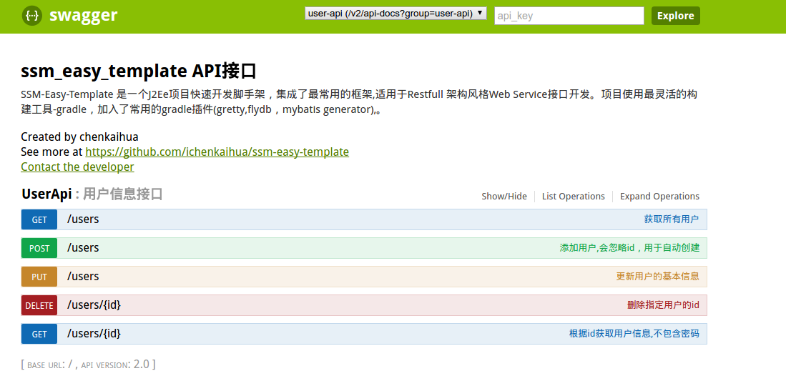
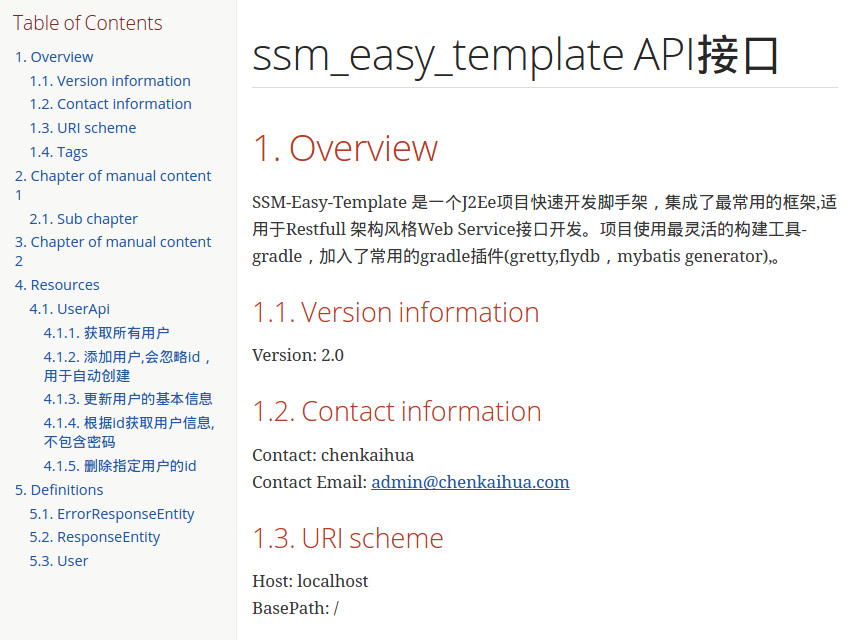

# ssm-easy-template

## 介绍
**Ssm-Easy-Template** 是一个J2Ee项目快速开发脚手架，集成了最常用的框架,适用于`Restfull` 架构风格`Web Service`接口开发。项目使用最灵活的构建工具-`gradle`，加入了常用的gradle插件(`gretty`,`flydb`，`mybatis generator`),集成`swagger2`，`asciidoctor`，自动生成`rest api`文档。

#### 组成
##### 主要框架
* **Spring4.2**: 不多说，貌似J2EE离不开他了。
* **Springmvc4.2**: 与Spring无缝集成，简单灵活，支持Restful风格。
* **Mybatis3.3.0** :个人认为比Hibernate好控制，毕竟是自己写的Sql语句。
* **Shiro**: Apache的权限管理框架，扩展性好，使用简单，个人认为比`Spring-Security`框架容易入手。
* **tomcat连接池** : 稳定，性能好。
* **sf4j** ：支持多种日志系统，使用的是log4j。
* **spring-fox**: 自动生成rest api文档
* **asccidoctor**: 将rest api转换成html5和pdf格式的硬文档

##### 工具框架
* **Spring-Test** :包括了常用单元测试、集成测试、Web测试，`Src/Test/Java`下有几个简单的测试类。使用测试框架的好处就是节省时间，无需启动Server就能测试程序。
* **Mybatis-Pagehelper** :Mybatis的分页排序插件，由国人开发，用起来非常方便，[Mybatis-Pagehelperp][2] 项目主页。
* **Mybatis通用Mapper3** 也是有上面作者开发，极其方便的使用Mybatis单表的增删改查，如果是单表操作，基本不用写Mapper文件,[Mybatis通用Mapper3][3] 项目主页。
* **Spring-Mail**： 可修改`/src/main/resource/mail-config.properties`配置文件，这个配置文件配置的是主邮箱。
* **commons fileupload**:`spring mvc`中集成了`appache-commons-fileupload`上传组件。上传处理更便捷。

### 效果图




#### 开发工具
##### IDE
Eclipse确实强大，但 [Intellij Idea][1] 更智能，强烈推荐 **Idea**
##### 依赖管理工具
`Maven`可能更容易上手，但我更喜欢`Gradle`的简洁

## 使用
### 下载
`Download Zip`或者`git clone`
``` shell
	git clone https://github.com/ichenkaihua/ssm-easy-template.git
```


### 快速开始
新建或者配置一个mysql数据库，根据数据库信息修改`src/main/resources-dev/jdbc-mysql.properties`文件。
然后进入命令行:

```shell
# 进入项目目录
cd ssm-easy-template/

# 初始化数据库,将db/migration目录下sql迁移到本地数据库
./gradlew flywayMigrate

# jetty启动项目
./gradlew  appStart

# 获取所有用户 
curl  http://localhost:8080/users

# 其他操作...

# 关闭jetty
./gradlew appStop
```

### 导入
建议使用IDEA，eclipse也没问题

### 详细修改

#### 利用[mybatis-generator(MBG)][6] 生成`model/mapper/mapper.xml`文件
Mybatis考虑到手写XML文件的繁琐，因此开发了MBG工具，通用Mapper这个项目再次简化了mybatis的生成代码数量。ssm-easy-template把mybatis generator放在`build.gradle`中，封装成一个`Gradle Task`。

 * **修改generator配置文件**: 打开`gradle.propertis`文件,修改生成信息(数据库信息在`src/main/resources/db-mysql.properties`)，默认如下

```shell
#生成的model类所在包
modelPackage=com.github.ichenkaihua.model
#生成的mapper接口类所在包
mapperPackage=com.github.ichenkaihua.mapper
#生成的mapper xml文件所在包，默认存储在resources目录下
sqlMapperPackage=mybatis_mapper

```
* **执行 mybatisGenerate task** :
```shell
./gradlew mybatisGenerate
```

#### 修改项目配置文件
在`src/main/resources`目录下，有下列文件：

```shell
#项目运行的数据库配置
jdbc-mysql.properties
#log4j配置
log4j.properties
#mail 
mail-config.properties
#spring Application root Context
spring-config.xml
# spirng-mail
spring-mail.xml
#springMVC context
spring-mvc-config.xml
#springMVC shiro
spring-mvc-shiro.xml
#spring-mybatis
spring-mybatis.xml
#spring-shiro
spring-shiro.xml
#spring-tomcatl-pool 连接池
spring-tomcat-pool.xml
#连接池配置
tomcat-pool-config.properties
```
**ssm-easy-template把项目配置分离，便于后期扩展或替换组件。根据项目需要更改配置文件**

#### 数据库开发环境切换

项目开发中，通常有多个环境，一个是用于本地调试的开发环境，另一个是用于对外发布的生产环境。
在本地开发环境中，使用本地安装的数据库，在生产环境中使用生产环境的数据库。这样就能避免本地调试不当导致对生产环境数据造成破坏。本项目用gradle简单实现了此功能

**如何使用**

* 根据项目情况，修改`src/main/resources-dev/jdbc-mysql.properties`，这个文件是开发环境下数据库配置,通常配置的本地数据库环境
* 根据项目情况，修改`src/main/resources-prod/jdbc-mysql.properties`，这个文件是开发环境下数据库配置,通常配置的是外网数据库环境
* 修改`gradle.properties`配置文件的属性`env=dev`,有两个选项:`dev`--本地环境,`prod`--生产环境
* 重新build或appStart即可

> **需要注意的是**: `resources-dev/jdbc-mysql.properties` 和`resources-prod/jdbc-mysql.properties`两个文件的字段名要一致，因为spring会读取这两个文件中的一个，字段不一致会导致出错

### 生成restAPI文档

项目集成了[spring-fox][7],[asccidotor][8]，能够在线浏览restapi，并生成`html`,`pdf`格式的硬文档
项目启动后，打开`http://localhost:8080/swagger-ui.html`即可查看api文档

``` shell
# 生成html和pdf文档
gradle asccidoctor
```
之后在`build/asccidoc`目录下可以找到生成的html5和pdf文件.

> 生成的pdf文件有中文显示不全的问题,这是asciidoctor的官方bug,现在已经有方案解决,建议使用`asciidoctor-pdf`工具,使用自定义主题解决这问题.请参考 [这里](https://github.com/asciidoctor/asciidoctor-pdf/issues/82)


#### 实现项目逻辑

为了方便后期扩展与重用，ssm-easy-template封装出`BaseService<Mapper<M>,M>`,通常service继承`BaseService<Mapper<M>,M>`，单表操作的逻辑不需要再实现


### 部署
SSM-Easy-Template集成了`gretty`插件,更多使用方法前往[gretty官网][5]
```shell
# jetty启动项目，http://locaohost:8080/
./gradlew  jettyStart

#关闭jetty
./gradlew jettyStop

```

### Debug
可以参考[IntelliJ IDEA +gradle+gretty debug j2ee web-application](http://www.chenkaihua.com/2016/02/20/idea-webapp-remote-debug-via-gretty/)


### 修改记录

* 2017-4-4 --v3.0
    * 更新`spring`版本到最新`4.3.7.release`
    * 更新`mysql-connector-java`版本到`6.0.6`
    * 更新一系列依赖到最新版本


[changelog](doc/changelog.md)

### 相关文档
* [在gradle中使用MyBatis Generator生成model,dao,mapper
](http://chenkaihua.com/2015/12/19/running-mybatis-generator-with-gradle/)


## 关于我
**博客链接**:[陈开华的博客][4]

**Email**: admin@chenkaihua.com

[1]:https://www.jetbrains.com/idea/
[2]: https://github.com/pagehelper/Mybatis-PageHelper
[3]:https://github.com/abel533/Mapper
[4]:http://www.chenkaihua.com
[5]:https://github.com/akhikhl/gretty
[6]:http://mybatis.github.io/generator/
[7]: http://springfox.github.io/springfox/
[8]: http://asciidoctor.org/
